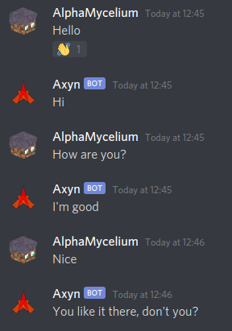

# Axyn

A simple Discord chatbot.

## Run

Set the environment variable `DISCORD_TOKEN` to your Discord bot token. This is
needed to access the Discord API. Then, simply launch `axyn/main.py`.

## Usage

### Chat

You can chat to Axyn at any time by sending it a DM. It will display the typing
status while a response is generated. If the bot stops typing and nothing is
sent, this means that it didn't know how to respond or was less than 50%
certain.

Axyn will also respond to messages in servers, if noone else has responded
within 3 minutes and it is more than 80% certain.

### Reactions

Axyn adds reactions to messages it receives, both in servers and DMs, if it has
learned any which match that message.

### DisplaCy

Axyn provides the command `a!analyse`, which displays a dependency parse
for the given text. This is generated by SpaCy and rendered with DisplaCy.
A reference of what the different dependency types mean is available
[here](https://spacy.io/api/annotation#dependency-parsing-english).

## How does it work?

*This was originally a wrapper around
[Chatterbot](https://github.com/gunthercox/ChatterBot), however response times
were getting far too slow and I was customizing the behaviour a lot. In the end
I wrote my own implementation following the same basic principles.*

Axyn learns how to respond based on messages it receives. It tries to guess
which other message the message is in response to, and saves it. If someone
sends the first message again, it will find the stored response and re-use it.

First, input messages are converted to a 300-dimensional vector
[using SpaCy](https://spacy.io/api/token#vector). Then this vector is used to
find the closest match in an [NGT](https://github.com/yahoojapan/NGT) index
containing the vectors of learned messages. Each object ID from the index
corresponds to one or more possible responses, which are stored in a simple
database table. Finally, the most common response from the possibilities is
chosen, or if there is no mode then one is selected at random.

A similar approach is applied for reactions, swapping the stored textual
responses for a single emoji per entry.
